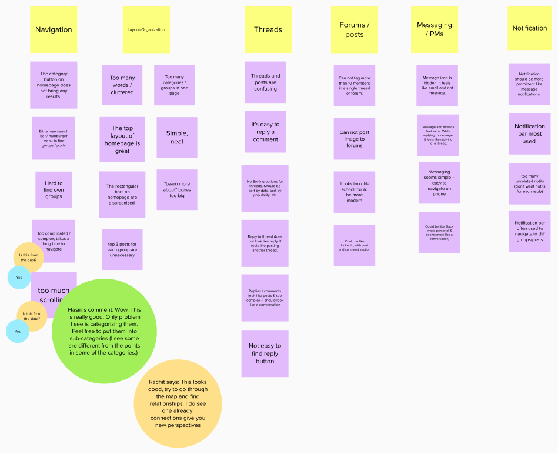
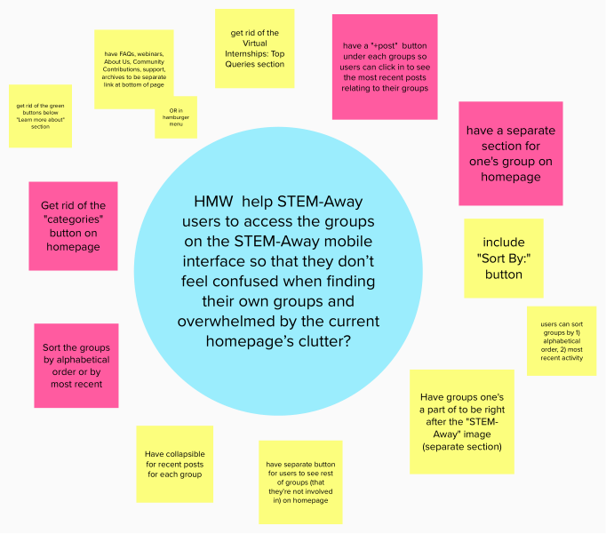
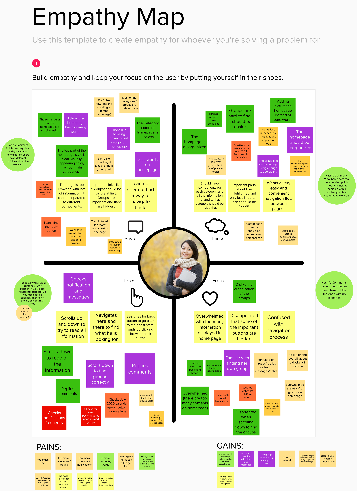
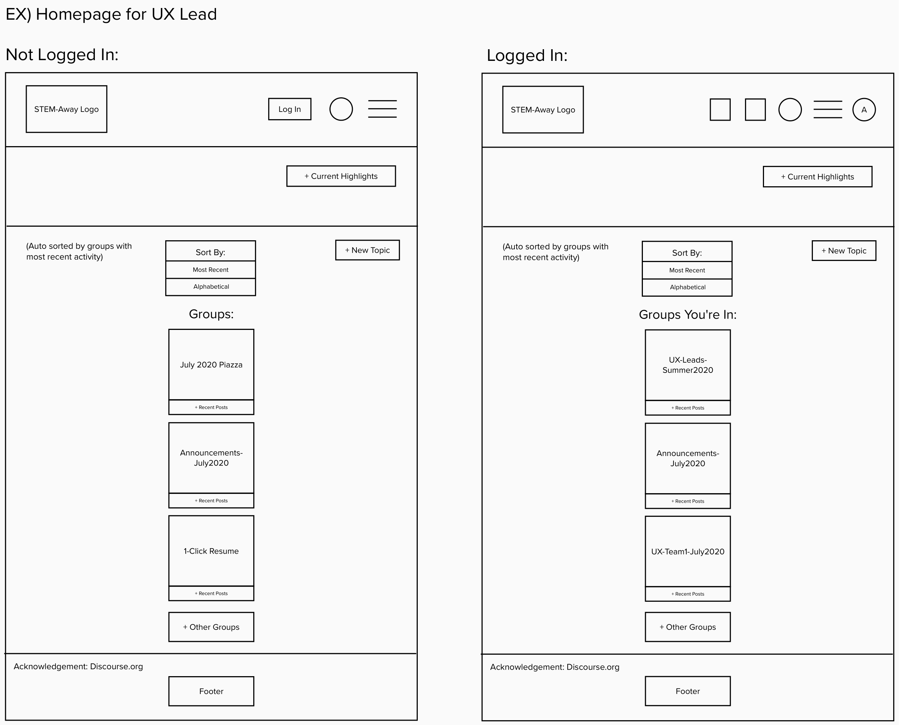
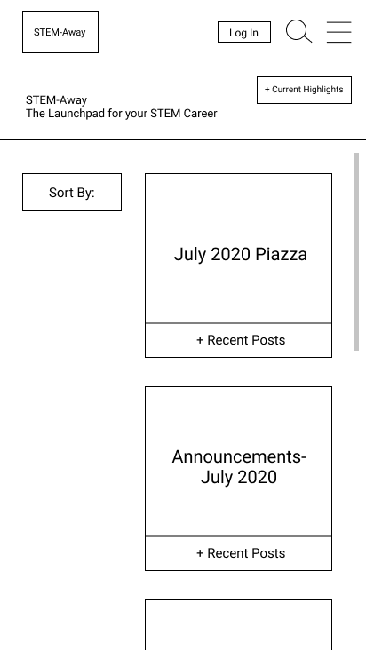

## Background:
STEM-Away is a company based in California whose main mission is to help "students 
discover the potential & beauty of STEM" through virtual, educational internships and 
projects.
During the summer of 2020, I was a participant of STEM-Away's UX/UI track. My team and
I focused on redesigning the mobile interface of STEM-Away's homepage for our project. 
We then presented our final product to the STEM-Away users, stakeholders, and founder
at the end.

As the nature of this internship was remote, everyone was in different time zones.
Because of this, I communicated frequently with the project leads and team members alike
to coordinate meeting times (outside of our regular meetings with the project leads)
and tried to 

## Process:

### *Defining the Problem*
To pinpoint the problems that users had with the mobile interface of the STEM-Away
website, we:

1. Conducted user research interviews. 
- We created interview questions on a document to make our interviews as efficient
as possible.
- Each member of the team interviewed 1-2 people.
- I interviewed 3: two of my interviewees were STEM-Away participants and 
one was a STEM-Away stakeholder. 

2. Collected and analyzed data from the interviews using empathy maps, personas, and
affinity diagrams.
- To collect data from the interviews, I went through the interviews I conducted and 
created transcripts accordingly. I then narrowed down the data from the transcripts
by highlighting the strengths and weaknesses of the current mobile interface.
- After communicating via Slack and scheduling meetings with the rest of the team members,
we met via Zoom to create empathy maps, personas, and affinity diagrams from our analyses.
- We tried to find any emerging trends, patterns, major problems, and the causes behind
them. We also tried to narrow down our data to focus on one specific feature that we could
focus on for our project.

```
From our interviews, there were various features that our interviewees struggled with:
1. Navigation
2. Layout/Organization
3. Threads
4. Forums/posts
5. Messaging/Private Messaging
6. Notifications
```


After narrowing down our interview data, we decided to focus on the organization of groups
on the homepage. We then came up with a "How Might We" statement to tackle on and brainstormed 
various ways that could help resolve the problems that STEM-Away users were currently facing.

 


---

### *Ideating/Designing/Prototyping*

For our design, we wanted to create a clean, minimalistic design that emphasized 
user personalization. 

To do this, we:

1. Sketched the rough wireframe on Mural
- Using the data that we collected and analyzed, we came up with a rough sketch of
the mobile interface to tackle the problems that came up in our interviews.
- Some of the features implemented in our wireframe and prototypes were:
```
1. Collapsibles to minimize clutter on the homepage
2. Sort-by button for users to organize groups based on their preference
```



2. Created low-fidelity prototypes using Figma.
- We initially created two sets of prototypes, but after feedback from the project leads,
chose the [following](https://www.figma.com/proto/kjcM4LpF616fOQFASy8SYZ/Low-Fidelity-Prototypes?node-id=1%3A3&scaling=scale-down) 
as our "final" low-fidelity prototype.
- The design was also made interactive so that users could click through the elements on
the page.
- Additional features we implemented in our low-fidelity prototype were:
```
1. The "lock" and "pin" icons to make the platform more user-friendly
(locks for private groups, pins to indicate which groups the user "prioritized" or
pinned)
2. Breadcrumbs for easier navigation
3. "Explore Groups You're Not In" button for logged-in users
4. "Load More" button
```

3. Created the [final high-fidelity prototype](https://www.figma.com/proto/0l7X9o20Goj5gglEbIceXX/High-Fidelity-Prototype?node-id=1%3A2&scaling=min-zoom) 
using Figma.
- After receiving feedback from the project leads, we adjusted our designs accordingly
and brushed up on the colors and additional details.
- Some of these adjustments were:
```
1. Reorganizing and making texts, shapes, etc. bigger to minimize whitespace
2. Adding colors that matched the STEM-Away platform and were the best representation
for different pathways (EX. Bioinformatics, UX/UI, Machine Learning, etc)
3. Adding pathway buttons to further organize groups on the homepage
4. Fixing/shortening terminologies
5. Getting rid of breadcrumbs and the "load more" button as: a) users didn't regularly go
through many pages to warrant breadcrumbs, and b) scrolling is more natural for mobile users 
than clicking buttons on-screen
```

Our Low & Final High-Fidelity Prototypes:
 
